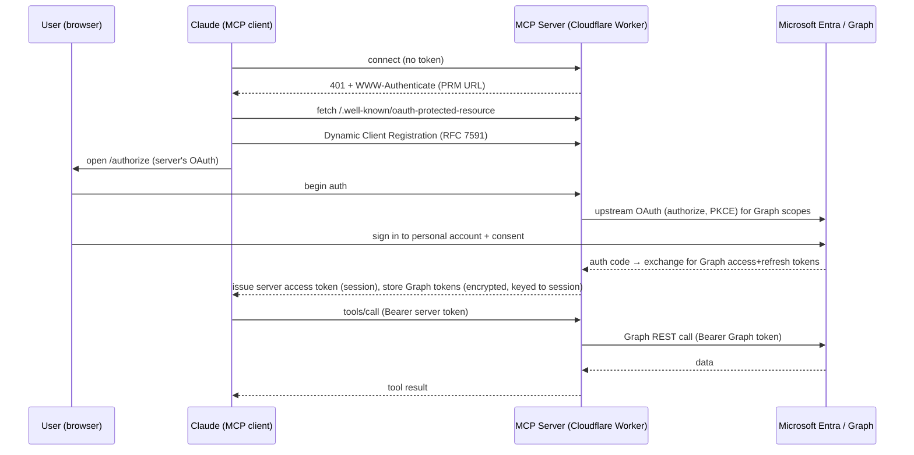

# Requirements: Personal Microsoft 365 (Outlook.com) MCP Connector for Claude

**Document type:** Build specification / requirements
**Audience:** Claude Code (in VS Code) building the connector, and the repository owner reviewing it
**Version:** 1.0
**Date:** 2026-07-19
**Owner:** Tony Goodhew

---

## 1. Purpose & context

Claude's official **Microsoft 365 connector only supports work/school (Microsoft Entra) accounts** — it explicitly rejects personal accounts such as `@hotmail.com`, `@outlook.com`, and `@live.com`. The owner keeps travel/booking confirmations (and a calendar) in a **personal `tony_goodhew@hotmail.com` account**, which Claude therefore cannot read or write today.

This document specifies a **custom Claude connector** — implemented as a **remote MCP (Model Context Protocol) server** — that authenticates to a **personal Microsoft account** via the **Microsoft Graph API** and exposes tools for Claude to:

1. **Search and read email** (to find booking confirmations, e.g. Monsoon Aquatics, Macadamias Australia), and
2. **Read and write calendar events** (to add those bookings, with travel-time blocks, directly to the personal calendar — no more `.ics` hand-off).

The immediate motivating use case: *"Find the booking confirmations in my personal inbox and add each one to my personal calendar with travel time before and after."*

### Why this is possible when the official connector is not
The official connector's limitation is a **product policy** of Anthropic's first-party integration, not a Graph limitation. Microsoft Graph **does** support personal Microsoft accounts for mail and calendar when you register **your own** Entra application configured for personal accounts. This connector uses that path.

---

## 2. Goals & non-goals

### Goals
- A production-quality, secure remote MCP server that a single user (the owner) can connect to Claude as a **custom connector**.
- Least-privilege access to **mail read** and **calendar read/write** on a **personal** Microsoft account.
- Correct, timezone-safe calendar writes (events land at the intended local wall-clock time).
- Deployable by Claude Code end-to-end with clear, reproducible steps and automated tests.
- Runs at effectively **$0/month** for personal single-user volume.

### Non-goals (v1)
- Multi-user / multi-tenant SaaS. This is a **single-user** connector (though written so it could be extended).
- Contacts, Files/OneDrive, Teams, or SharePoint access (explicitly out of scope; see §6 scope decision).
- Deleting or permanently destroying mail. **No hard-delete tools.** (Calendar event deletion is optional and gated — see §7.5.)
- Sending email on the user's behalf in v1 (no `Mail.Send`). Can be a future phase.

---

## 3. Glossary

| Term | Meaning |
|---|---|
| **MCP** | Model Context Protocol — open standard for exposing tools/resources to LLM clients like Claude. |
| **Remote MCP server** | An MCP server reachable over HTTPS (vs. a local stdio server). Required for Claude custom connectors. |
| **Streamable HTTP** | The current MCP transport for remote servers (supersedes the legacy HTTP+SSE transport). |
| **Microsoft Graph** | Microsoft's unified REST API for Microsoft 365 / Outlook.com data (`https://graph.microsoft.com`). |
| **Entra app registration** | An OAuth application registered in Microsoft Entra ID (formerly Azure AD) that authorizes Graph access. |
| **MSA** | Microsoft Account — a *personal* account (`hotmail.com`/`outlook.com`/`live.com`). |
| **PRM** | Protected Resource Metadata (RFC 9728) — how an MCP server advertises its authorization server. |
| **DCR** | Dynamic Client Registration (RFC 7591) — lets an OAuth client register itself automatically. |
| **PKCE** | Proof Key for Code Exchange — OAuth extension protecting the authorization-code flow. |

---

## 4. High-level architecture

There are **two OAuth relationships**, and getting this separation right is the crux of the design:

1. **Claude ⇆ MCP server (downstream):** Claude is an MCP OAuth *client*. Your MCP server acts as the **OAuth authorization server + resource server** to Claude. Claude discovers auth via PRM, (dynamically) registers, and obtains a token scoped to *your server*.
2. **MCP server ⇆ Microsoft (upstream):** To actually call Graph, your server performs a **separate, pre-registered** OAuth authorization-code (+PKCE) flow against **Microsoft Entra**, obtaining Graph access/refresh tokens for the signed-in personal account.



### Why this pattern (important)
**Microsoft Entra does not support Dynamic Client Registration.** Claude's connector, however, expects either DCR or a manually entered client ID/secret. The clean, well-trodden solution is a library that makes **your server** the OAuth server to Claude (implementing DCR + PRM for the Claude side) while your server holds a **single pre-registered Entra app** (client ID + secret) for the Microsoft side. Cloudflare's `workers-oauth-provider` implements exactly this "your Worker is the OAuth server, with an upstream IdP" pattern. See §6 and references.

---

## 5. Technology stack decision

### Language/runtime: **TypeScript on Node.js** — recommended and assumed by this spec
- **Most common for MCP servers.** The MCP ecosystem is TypeScript-first; the TypeScript SDK (`@modelcontextprotocol/sdk`) is the reference implementation, and the majority of public remote-MCP examples (including Cloudflare's and Anthropic's) are TypeScript.
- **Least friction for Claude Code + VS Code.** First-class types, the richest set of copy-adaptable OAuth examples, excellent VS Code tooling, and native support in the MCP Inspector and the VS Code MCP client for local testing.
- Python (FastMCP) is a fine alternative but has fewer turnkey *hosted-OAuth* remote examples; C# is supported but less common here.

**Decision:** Build in **TypeScript**. Target Node 20+ for local dev; deploy on the Workers runtime (see hosting).

### Hosting: **Cloudflare Workers** — recommended (with alternatives and costs in §11)
- Purpose-built path for remote MCP servers: the `agents` SDK's **`McpAgent`** class + the **`workers-oauth-provider`** library give you Streamable HTTP transport, per-session state (Durable Objects), and the downstream-OAuth-server behavior out of the box.
- Free, public **HTTPS** endpoint on `*.workers.dev` that is reachable from Anthropic's IP ranges (a hard requirement — the server must be on the public internet, not behind a VPN/firewall).
- Scales to zero; **$0/month** at personal volume (see cost analysis).

---

## 6. Scope decision (capabilities)

**Chosen scope: Mail read + Calendar read/write** (least privilege for the use case).

| Capability | Graph delegated scope | Included in v1? |
|---|---|---|
| Read/search mail | `Mail.Read` | ✅ Yes |
| Read calendars/events | `Calendars.Read` (covered by ReadWrite) | ✅ Yes |
| Create/update calendar events | `Calendars.ReadWrite` | ✅ Yes |
| Sign-in / profile | `openid`, `profile`, `email`, `User.Read` | ✅ Yes |
| Refresh tokens (offline) | `offline_access` | ✅ Yes |
| Send mail | `Mail.Send` | ❌ Future phase |
| Contacts / Files / Teams | (various) | ❌ Out of scope |

Do **not** request `Mail.ReadWrite` or `Mail.Send` in v1 — read is sufficient to find bookings, and narrower scopes reduce blast radius and consent friction.

---

## 7. Functional requirements — MCP tools

All tools MUST:
- Validate inputs with **zod** schemas and reject malformed input with clear errors.
- Call Microsoft Graph **v1.0** (`https://graph.microsoft.com/v1.0`) using the user's upstream Graph access token.
- Handle **pagination** (`@odata.nextLink`), **throttling** (HTTP 429 + `Retry-After`), and **token expiry** (401 → refresh once → retry).
- Return concise, structured results (JSON-serializable) plus a short human-readable summary.
- Never include secrets or raw tokens in tool output or logs.

### 7.1 `list_messages` (search/list mail)
- **Purpose:** Find booking/confirmation emails.
- **Graph:** `GET /me/messages` with `$search` (keyword) or `$filter` (structured), `$select`, `$top`, `$orderby=receivedDateTime desc`.
- **Inputs:** `query?` (keyword string, maps to `$search`), `from?`, `subjectContains?`, `receivedAfter?`/`receivedBefore?` (ISO 8601 → `$filter`), `limit?` (default 10, max 25), `pageToken?`.
- **Notes:** When using `$search`, follow Graph rules (KQL-style, e.g. `"subject:confirmation"`). Prefer `$filter` for date ranges. Return `id`, `subject`, `from`, `receivedDateTime`, `webLink`, `bodyPreview`, `hasAttachments`, and a `nextPageToken` when more results exist.
- **Permission:** `Mail.Read`.

### 7.2 `get_message` (read one email)
- **Purpose:** Read a full confirmation to extract date/time/venue.
- **Graph:** `GET /me/messages/{id}` (optionally `?$select=subject,body,from,receivedDateTime,webLink`).
- **Inputs:** `id` (required), `format?` (`text`|`html`, default `text` — request `body` and strip/ý convert HTML to text server-side for token efficiency).
- **Output:** subject, from, receivedDateTime, plain-text body, webLink, attachment metadata (names/sizes only; no binary in v1).
- **Permission:** `Mail.Read`.

### 7.3 `list_events` (read calendar)
- **Purpose:** Check for conflicts / see what's already scheduled.
- **Graph:** `GET /me/calendarView?startDateTime=...&endDateTime=...` (preferred for a date range) or `GET /me/events`.
- **Inputs:** `startDateTime`, `endDateTime` (ISO 8601, required), `timeZone?` (IANA, default `Australia/Brisbane`), `limit?`.
- **MUST** send header `Prefer: outlook.timezone="<IANA tz>"` so returned times are in the requested zone.
- **Output:** per event: `id`, `subject`, `start`/`end` (with timeZone), `location`, `isAllDay`, `webLink`.
- **Permission:** `Calendars.Read` (satisfied by `Calendars.ReadWrite`).

### 7.4 `create_event` (write calendar) — core capability
- **Purpose:** Add a booking (and separate travel-time blocks) to the calendar.
- **Graph:** `POST /me/events` → `201 Created`.
- **Inputs (zod):**
  - `subject` (string, required)
  - `start` `{ dateTime: string (local wall-clock, no offset), timeZone: string (IANA, e.g. "Australia/Brisbane") }` (required)
  - `end` `{ dateTime, timeZone }` (required)
  - `location?` (string → `location.displayName`)
  - `body?` (string → `body.contentType="text"`, `body.content`)
  - `isReminderOn?`, `reminderMinutesBeforeStart?`
  - `transactionId?` (client-supplied idempotency key; if omitted, generate a UUID)
- **Idempotency:** Set the Graph `transactionId` property so repeated calls (e.g. Claude retrying) do **not** create duplicates.
- **Timezone correctness (critical):** Send `dateTime` as a **local wall-clock** string (e.g. `2026-07-20T12:00:00`) paired with an **IANA `timeZone`** (`Australia/Brisbane`). Microsoft Graph accepts IANA names in addition to Windows names; you can enumerate valid values via `GET /me/outlook/supportedTimeZones`. Do **not** send a UTC `Z` value with a named non-UTC timeZone.
- **Output:** the created event's `id`, `webLink`, and normalized start/end for confirmation.
- **Permission:** `Calendars.ReadWrite`.
- **Safety:** This is a write. The tool description MUST instruct the model to **confirm details with the user before calling**, and the tool MUST return the created event so Claude can echo it back.

### 7.5 `update_event` / `cancel_event` (optional, gated)
- `update_event`: `PATCH /me/events/{id}` for time/location/subject edits. Include in v1 (low risk, high utility).
- `cancel_event` (soft): `DELETE /me/events/{id}` removes an event. **Optional.** If included, the tool description MUST require explicit user confirmation and MUST be clearly labeled destructive. (Per Claude's action rules, deletion is sensitive — prefer that the human confirms.)

### 7.6 `whoami` (diagnostics)
- **Graph:** `GET /me` → returns `displayName`, `userPrincipalName`/`mail`. Useful to confirm the right account is connected. Permission: `User.Read`.

---

## 8. Authorization & identity requirements

### 8.1 Microsoft Entra app registration (upstream)
Claude Code MUST document/produce these settings (created once, by the owner, in the Entra portal):
- **Supported account types:** *"Accounts in any organizational directory (Any Microsoft Entra ID tenant – Multitenant) **and personal Microsoft accounts** (e.g. Skype, Xbox)."* This is what enables `hotmail.com`.
- **Authority / tenant:** use the **`common`** endpoint: `https://login.microsoftonline.com/common/oauth2/v2.0/{authorize|token}`.
- **Platform:** Web. **Redirect URI:** the server's upstream callback, e.g. `https://<worker-name>.<subdomain>.workers.dev/callback` (and `http://localhost:8788/callback` for local dev).
- **Client secret:** generate one; store as a server secret (never in source).
- **API permissions (delegated):** `openid`, `profile`, `email`, `offline_access`, `User.Read`, `Mail.Read`, `Calendars.ReadWrite`.

### 8.2 Downstream (Claude ⇆ server) OAuth — MUST
- Implement OAuth 2.1 with **PKCE**, **PRM** (RFC 9728), and **DCR** (RFC 7591) so Claude can connect with no manual client config.
- On unauthenticated requests, return `401` with `WWW-Authenticate: Bearer ... resource_metadata="…/.well-known/oauth-protected-resource"`.
- Issue **short-lived** server access tokens; support refresh.
- **Validate token audience** — reject tokens not minted for this server (prevents token-passthrough/confused-deputy).

### 8.3 Token handling — MUST
- Store upstream Graph refresh tokens **encrypted at rest** (Workers KV + a `COOKIE_ENCRYPTION_KEY`/secret), keyed to the authenticated session; never return them to the client.
- Refresh Graph tokens automatically on expiry; single retry on 401.
- Do **not** reuse the server's own client secret for end-user flows; keep app vs. resource-server credentials separate.

---

## 9. Non-functional requirements

### 9.1 Security (map to MCP Security Best Practices)
- **HTTPS only** in production; `localhost` allowed only for dev.
- **Least-privilege scopes** (see §6); verify required scope per tool.
- **Never log** `Authorization` headers, tokens, codes, or secrets; scrub query strings; redact structured logs.
- **Use vetted libraries** for token validation — do not hand-roll crypto/JWT validation.
- **Generic error messages** to the client; detailed reasons logged internally with a correlation ID.
- Treat `Mcp-Session-Id` as untrusted; never tie authorization decisions to it.
- Pin to a single issuer/tenant configuration; reject tokens from other issuers.

### 9.2 Reliability & performance
- Handle Graph **429**/`Retry-After` with capped exponential backoff (max ~3 retries).
- Enforce result caps and pagination to bound response size (protect the model's context).
- Reasonable timeouts (e.g. 10s Graph calls) and clear timeout errors.

### 9.3 Observability
- Structured request logging (method, route, status, latency) **without** sensitive data.
- A `/health` endpoint returning 200 for uptime checks.

### 9.4 Timezone & locale
- Default IANA zone: **`Australia/Brisbane`** (UTC+10, no DST). All calendar reads send `Prefer: outlook.timezone`. All writes pass IANA `timeZone`. Document this assumption and make it configurable.

---

## 10. Repository layout (target)

```
personal-outlook-mcp/
├─ README.md                      # setup, deploy, connect, troubleshoot
├─ REQUIREMENTS.md                # this document
├─ package.json
├─ tsconfig.json
├─ wrangler.jsonc                 # Cloudflare config (KV binding, vars)
├─ .dev.vars.example              # local secrets template (never commit real)
├─ .gitignore                     # ignores .dev.vars, .env, dist, node_modules
├─ src/
│  ├─ index.ts                    # Worker entry: OAuthProvider wiring + McpAgent
│  ├─ mcp.ts                      # McpServer + tool registrations
│  ├─ auth/
│  │  ├─ microsoft.ts             # upstream Entra OAuth (authorize/callback/refresh)
│  │  └─ tokens.ts                # encrypted token storage (KV), refresh logic
│  ├─ graph/
│  │  ├─ client.ts                # fetch wrapper: auth header, retry/429, paging
│  │  ├─ mail.ts                  # list_messages, get_message
│  │  └─ calendar.ts              # list_events, create_event, update_event
│  ├─ tools/                      # zod schemas + tool handlers (thin, call graph/*)
│  └─ util/{time.ts,log.ts,errors.ts}
└─ test/
   ├─ unit/                       # zod schemas, time mapping, graph client (mocked)
   └─ integration/               # MCP Inspector / live Graph (opt-in via env)
```

---

## 11. Hosting recommendation & cost analysis

**Recommended: Cloudflare Workers (Free plan).** For a single user issuing at most a few hundred calls/day, usage sits far inside the free tier.

| Host | Model | Expected monthly cost (this use) | Notes |
|---|---|---|---|
| **Cloudflare Workers (recommended)** | Free: 100,000 req/day; Paid: **$5/mo** for 10M req/mo | **$0** (free tier is ample) | Native MCP + OAuth libraries; `*.workers.dev` HTTPS; KV free tier (100k reads/day, 1k writes/day, 1 GB). |
| Render (Web Service) | Free (sleeps) or **$7/mo** Starter | $0–7 | Simple Docker/Node deploy; free tier cold-starts. |
| Fly.io | Pay-as-you-go | ~$2–5 | Scale-to-zero possible; small always-on cost otherwise. |
| Azure Container Apps | Consumption (scale-to-zero) | ~$0–a few $ | Keeps everything in Microsoft's cloud if preferred; more config. |
| Self-host (home server) | Your hardware | $0 hardware, but **not recommended** | Must be **publicly reachable from Anthropic IPs over HTTPS** — a home box behind NAT/VPN/firewall will **not** work without a tunnel + domain + TLS. Adds security burden. |

**One-time/other costs:** Entra app registration is **free**. A custom domain is **optional** (~$8–15/yr) — the free `workers.dev` subdomain is sufficient. A Claude **Pro or Max** subscription is required to add a custom connector (already held); adding the connector itself costs nothing extra.

**Bottom line:** Expect **$0/month** on Cloudflare's free tier for personal use; **$5/month** only if you exceed free limits or want the Paid plan's headroom.

---

## 12. Implementation plan (milestones for Claude Code)

**Phase 0 — Scaffold**
- `npm create cloudflare@latest -- personal-outlook-mcp --template=cloudflare/ai/demos/remote-mcp-github-oauth` (start from the GitHub-OAuth demo, then swap the upstream provider to Microsoft). Initialize git; add `.gitignore`.

**Phase 1 — Upstream Microsoft OAuth**
- Implement `/authorize` → redirect to Entra `common` authorize (PKCE); `/callback` → exchange code for Graph tokens; encrypted token storage in KV; refresh logic.
- Add `whoami` tool; verify against a personal account.

**Phase 2 — Graph client + mail tools**
- `graph/client.ts` (auth, 429 retry, paging). Implement `list_messages`, `get_message`. Test against real inbox.

**Phase 3 — Calendar tools**
- Implement `list_events`, `create_event` (with `transactionId` idempotency + IANA timezone handling), `update_event`. Optional gated `cancel_event`.

**Phase 4 — Downstream MCP OAuth hardening**
- Ensure PRM, DCR, PKCE, audience validation, `WWW-Authenticate` challenges, short-lived tokens.

**Phase 5 — Tests, docs, deploy, connect**
- Unit + integration tests (see §13); write `README.md`; `wrangler deploy`; add as a Claude custom connector (§14). Run the acceptance test (§15).

---

## 13. Testing requirements

- **Unit tests** (Vitest): zod input validation; local-wall-clock↔IANA time mapping (assert `2026-07-20T12:00:00` + `Australia/Brisbane` is preserved, not shifted); Graph client retry/paging with mocked `fetch`.
- **MCP Inspector:** run `npx @modelcontextprotocol/inspector` against the local/deployed server to confirm the tool list, schemas, and OAuth flow interactively.
- **VS Code MCP client:** add the server (`MCP: Add Server…` → HTTP → URL) and exercise each tool from chat, confirming the consent flow completes for a personal account.
- **Live integration (opt-in):** behind an env flag, run `list_messages`→`get_message`→`create_event`→`list_events` against a throwaway test event; assert the created event's local time equals the requested time; clean up.
- **Security checks:** confirm no tokens appear in logs; confirm a request with no/invalid token returns `401` with a valid `WWW-Authenticate`/PRM pointer; confirm a token with the wrong audience is rejected.

---

## 14. Deploying & connecting to Claude

1. **Provision:** create the KV namespace (`npx wrangler kv namespace create "OAUTH_KV"`), set secrets (`wrangler secret put MICROSOFT_CLIENT_ID|MICROSOFT_CLIENT_SECRET|COOKIE_ENCRYPTION_KEY`), and configure `wrangler.jsonc`.
2. **Deploy:** `npx wrangler deploy` → note the endpoint, e.g. `https://personal-outlook-mcp.<subdomain>.workers.dev/mcp`.
3. **Register the Entra redirect URI** to match the deployed `/callback` URL.
4. **Add to Claude:** **Customize → Connectors → “+ Add custom connector”**, paste the server URL. (DCR means no manual client ID/secret needed. Requires a Pro/Max plan for individuals.)
5. **Authenticate:** complete the Microsoft sign-in/consent when prompted; verify with the `whoami` tool.

---

## 15. Acceptance criteria (definition of done)

The connector is complete when, from a normal Claude chat:
1. Claude lists the connector's tools after a one-time OAuth sign-in to the **personal** account.
2. `whoami` returns `tony_goodhew@hotmail.com`.
3. Asked to "find my Monsoon Aquatics and Macadamias Australia booking emails," Claude uses `list_messages`/`get_message` and returns the correct dates/times.
4. Asked to "add them to my calendar with 15-minute travel blocks before and after," Claude calls `create_event` and the events appear in the personal calendar **at the correct Australia/Brisbane local times**, with no duplicates on retry.
5. No secrets/tokens appear in any logs; unauthenticated requests are properly challenged; wrong-audience tokens are rejected.
6. `README.md` lets a fresh machine reproduce setup→deploy→connect; tests pass in CI.

---

## 16. Risks & mitigations

| Risk | Mitigation |
|---|---|
| Entra app not set to personal accounts → sign-in fails (AADSTS500208-type errors) | Explicitly set multitenant **+ personal accounts**; use `common` authority. |
| Timezone drift (event lands an hour off) | Local wall-clock + IANA `timeZone`; `Prefer` header on reads; unit test the mapping. |
| Duplicate events on model retry | `transactionId` idempotency key on `create_event`. |
| Token leakage | Encrypted KV storage, no token logging, short-lived downstream tokens, audience validation. |
| Server unreachable from Claude | Public HTTPS on Workers; never behind VPN/NAT/firewall. |
| Over-broad access | Mail **read-only**; no `Mail.Send`; deletion gated/optional. |
| Graph throttling | 429 + `Retry-After` backoff; result caps/pagination. |

---

## 17. Reference links (authoritative)

**Claude custom connectors**
- Get started with custom connectors (remote MCP): https://support.claude.com/en/articles/11175166-get-started-with-custom-connectors-using-remote-mcp
- Build custom connectors via remote MCP servers: https://support.claude.com/en/articles/11503834-build-custom-connectors-via-remote-mcp-servers
- Why the official M365 connector rejects personal accounts: https://support.claude.com/en/articles/12542951-set-up-the-microsoft-365-connector

**MCP protocol & SDKs**
- MCP Authorization tutorial (roles, PRM, DCR, PKCE, pitfalls): https://modelcontextprotocol.io/docs/tutorials/security/authorization
- MCP Authorization specification: https://modelcontextprotocol.io/specification/draft/basic/authorization
- MCP Security Best Practices: https://modelcontextprotocol.io/specification/draft/basic/security_best_practices
- TypeScript SDK: https://github.com/modelcontextprotocol/typescript-sdk
- MCP Inspector (testing): https://github.com/modelcontextprotocol/inspector
- Relevant RFCs: PRM https://datatracker.ietf.org/doc/html/rfc9728 · DCR https://datatracker.ietf.org/doc/html/rfc7591 · Resource Indicators https://datatracker.ietf.org/doc/html/rfc8707 · AS Metadata https://datatracker.ietf.org/doc/html/rfc8414 · OAuth 2.1 https://datatracker.ietf.org/doc/html/draft-ietf-oauth-v2-1-13

**Cloudflare hosting**
- Build a Remote MCP server: https://developers.cloudflare.com/agents/model-context-protocol/guides/remote-mcp-server/
- MCP authorization on Cloudflare: https://developers.cloudflare.com/agents/model-context-protocol/protocol/authorization/
- `workers-oauth-provider` library: https://github.com/cloudflare/workers-oauth-provider
- McpAgent API: https://developers.cloudflare.com/agents/model-context-protocol/apis/agent-api/
- Workers pricing: https://developers.cloudflare.com/workers/platform/pricing/

**Microsoft Graph & Entra**
- Register an app / supported account types: https://learn.microsoft.com/en-us/entra/identity-platform/quickstart-register-app
- Supported account types reference: https://learn.microsoft.com/en-us/entra/identity-platform/v2-supported-account-types
- Auth code flow (+PKCE): https://learn.microsoft.com/en-us/entra/identity-platform/v2-oauth2-auth-code-flow
- Graph permissions reference: https://learn.microsoft.com/en-us/graph/permissions-reference
- List messages: https://learn.microsoft.com/en-us/graph/api/user-list-messages?view=graph-rest-1.0
- Create event: https://learn.microsoft.com/en-us/graph/api/calendar-post-events?view=graph-rest-1.0
- calendarView (range reads): https://learn.microsoft.com/en-us/graph/api/calendar-list-calendarview?view=graph-rest-1.0
- dateTimeTimeZone resource: https://learn.microsoft.com/en-us/graph/api/resources/datetimetimezone
- Supported time zones (validate IANA names): https://learn.microsoft.com/en-us/graph/api/outlookuser-list-supportedtimezones?view=graph-rest-1.0
- `Prefer: outlook.timezone` header for reads: documented on the calendarView page above

---

## 18. Appendix

### 18.1 Example `create_event` Graph request
```http
POST https://graph.microsoft.com/v1.0/me/events
Authorization: Bearer <graph_access_token>
Content-Type: application/json

{
  "subject": "Macadamias Australia — visit",
  "body": { "contentType": "text", "content": "Booked via Rezdy. Ref: RU614MR." },
  "start": { "dateTime": "2026-07-20T10:00:00", "timeZone": "Australia/Brisbane" },
  "end":   { "dateTime": "2026-07-20T11:00:00", "timeZone": "Australia/Brisbane" },
  "location": { "displayName": "Macadamias Australia, Bundaberg QLD" },
  "transactionId": "8f2b7e2c-6a1e-4c7a-9b3a-2f0e1d4c5b6a"
}
```

### 18.2 Environment / secrets (never commit real values)
```
MICROSOFT_CLIENT_ID=<entra app client id>
MICROSOFT_CLIENT_SECRET=<entra app client secret>   # server secret
MICROSOFT_TENANT=common                              # personal + work accounts
COOKIE_ENCRYPTION_KEY=<random 32+ byte base64>       # encrypts stored tokens
DEFAULT_TIMEZONE=Australia/Brisbane
```

### 18.3 Kick-off prompt for Claude Code (paste into VS Code)
> Build the remote MCP server described in `REQUIREMENTS.md`. Use **TypeScript** on **Cloudflare Workers** with `@modelcontextprotocol/sdk`, the `agents` `McpAgent`, and `workers-oauth-provider`. Implement upstream **Microsoft Entra** OAuth (authority `common`, delegated scopes `openid profile email offline_access User.Read Mail.Read Calendars.ReadWrite`) with encrypted token storage in Workers KV. Implement the tools `whoami`, `list_messages`, `get_message`, `list_events`, `create_event`, `update_event` exactly per §7, including `transactionId` idempotency and IANA-timezone-correct calendar writes (default `Australia/Brisbane`). Enforce all §8–§9 security requirements. Produce unit + integration tests per §13 and a `README.md` covering setup, Entra app registration, deploy (`wrangler`), and adding the server as a Claude custom connector. Do not hard-code or log secrets. Stop and ask me before any destructive tool (e.g. `cancel_event`) is added.

---

*End of document.*
